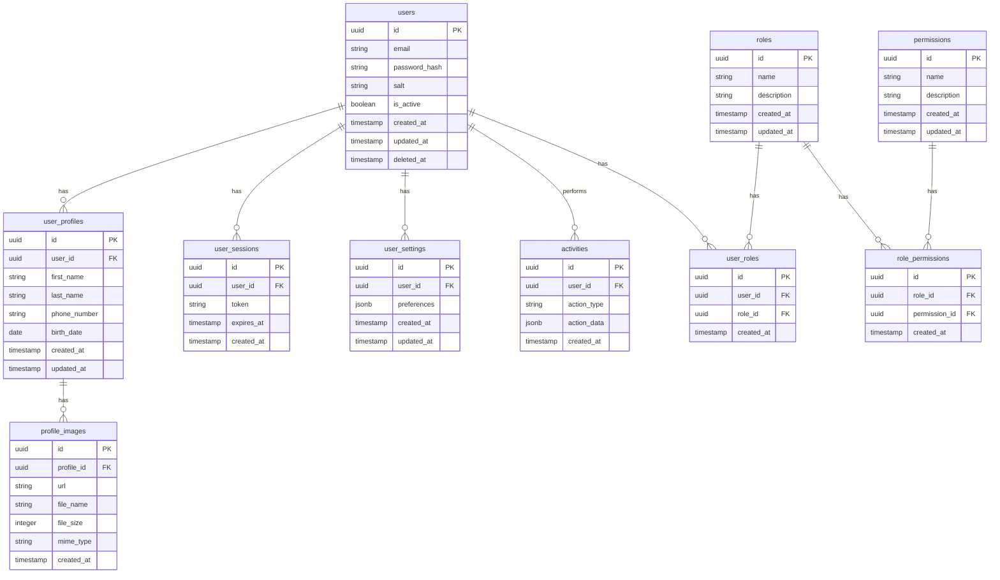

# データベース設計書

## 1. データベース概要

### 1.1 使用するデータベース
- メインDB: PostgreSQL 15.x
- キャッシュDB: Redis 7.x

### 1.2 データベース構成
- ユーザー管理DB
- トランザクションDB
- マスターDB
- ログDB

## 2. ER図



## 3. テーブル定義

### 3.1 users
| カラム名 | 型 | NULL | デフォルト | キー | 説明 |
|----------|-----|------|------------|------|------|
| id | uuid | NO | gen_random_uuid() | PK | ユーザーID |
| email | varchar(255) | NO | - | UQ | メールアドレス |
| password_hash | varchar(255) | NO | - | - | パスワードハッシュ |
| salt | varchar(255) | NO | - | - | パスワードソルト |
| is_active | boolean | NO | true | - | アカウント有効フラグ |
| created_at | timestamp | NO | CURRENT_TIMESTAMP | - | 作成日時 |
| updated_at | timestamp | NO | CURRENT_TIMESTAMP | - | 更新日時 |
| deleted_at | timestamp | YES | NULL | - | 削除日時 |

### 3.2 user_profiles
| カラム名 | 型 | NULL | デフォルト | キー | 説明 |
|----------|-----|------|------------|------|------|
| id | uuid | NO | gen_random_uuid() | PK | プロフィールID |
| user_id | uuid | NO | - | FK | ユーザーID |
| first_name | varchar(100) | YES | NULL | - | 名 |
| last_name | varchar(100) | YES | NULL | - | 姓 |
| phone_number | varchar(20) | YES | NULL | - | 電話番号 |
| birth_date | date | YES | NULL | - | 生年月日 |
| created_at | timestamp | NO | CURRENT_TIMESTAMP | - | 作成日時 |
| updated_at | timestamp | NO | CURRENT_TIMESTAMP | - | 更新日時 |

### 3.3 user_sessions
| カラム名 | 型 | NULL | デフォルト | キー | 説明 |
|----------|-----|------|------------|------|------|
| id | uuid | NO | gen_random_uuid() | PK | セッションID |
| user_id | uuid | NO | - | FK | ユーザーID |
| token | varchar(255) | NO | - | UQ | セッショントークン |
| expires_at | timestamp | NO | - | - | 有効期限 |
| created_at | timestamp | NO | CURRENT_TIMESTAMP | - | 作成日時 |

## 4. インデックス設計

### 4.1 users
| インデックス名 | カラム | 種類 | 説明 |
|----------------|--------|------|------|
| users_pkey | id | PRIMARY | 主キー |
| users_email_idx | email | BTREE | メールアドレス検索用 |
| users_deleted_at_idx | deleted_at | BTREE | 論理削除確認用 |

### 4.2 user_profiles
| インデックス名 | カラム | 種類 | 説明 |
|----------------|--------|------|------|
| user_profiles_pkey | id | PRIMARY | 主キー |
| user_profiles_user_id_idx | user_id | BTREE | ユーザーID検索用 |
| user_profiles_name_idx | (first_name, last_name) | BTREE | 名前検索用 |

### 4.3 user_sessions
| インデックス名 | カラム | 種類 | 説明 |
|----------------|--------|------|------|
| user_sessions_pkey | id | PRIMARY | 主キー |
| user_sessions_token_idx | token | BTREE | トークン検索用 |
| user_sessions_expires_at_idx | expires_at | BTREE | 有効期限確認用 |

## 5. パーティション設計

### 5.1 activities
- パーティション方式: RANGE
- パーティションキー: created_at
- パーティション期間: 月次
- 保持期間: 12ヶ月

### 5.2 ログテーブル
- パーティション方式: RANGE
- パーティションキー: created_at
- パーティション期間: 日次
- 保持期間: 3ヶ月

## 6. バックアップ設計

### 6.1 バックアップ方式
- フルバックアップ: 日次（AM 2:00）
- 差分バックアップ: 1時間ごと
- WALアーカイブ: リアルタイム

### 6.2 リテンション期間
- フルバックアップ: 30日
- 差分バックアップ: 7日
- WALアーカイブ: 7日

## 7. 監視設計

### 7.1 監視項目
- コネクション数
- クエリ実行時間
- ディスク使用率
- レプリケーション遅延
- キャッシュヒット率

### 7.2 アラート閾値
| 監視項目 | Warning | Critical | 
|----------|----------|-----------|
| コネクション数 | 80% | 90% |
| クエリ実行時間 | 3秒 | 5秒 |
| ディスク使用率 | 80% | 90% |
| レプリケーション遅延 | 30秒 | 60秒 |
| キャッシュヒット率 | 90% | 85% |

## 8. セキュリティ設計

### 8.1 アクセス制御
- ネットワークアクセス制限
- ユーザー権限管理
- 監査ログ取得

### 8.2 データ暗号化
- 通信経路の暗号化（TLS）
- 保存データの暗号化
- 個人情報のマスキング

## 9. パフォーマンスチューニング

### 9.1 チューニングパラメータ
```sql
-- メモリ関連
shared_buffers = 4GB
work_mem = 16MB
maintenance_work_mem = 1GB

-- クエリプランナー
random_page_cost = 1.1
effective_cache_size = 12GB

-- WAL
wal_buffers = 16MB
checkpoint_timeout = 30min
```

### 9.2 バキューム設計
- 自動バキューム: 有効
- バキューム実行条件
  - デッドタプル閾値: 1000
  - スケール係数: 0.2
- メンテナンスウィンドウ
  - 実行時間: AM 3:00-4:00
  - 頻度: 毎日 