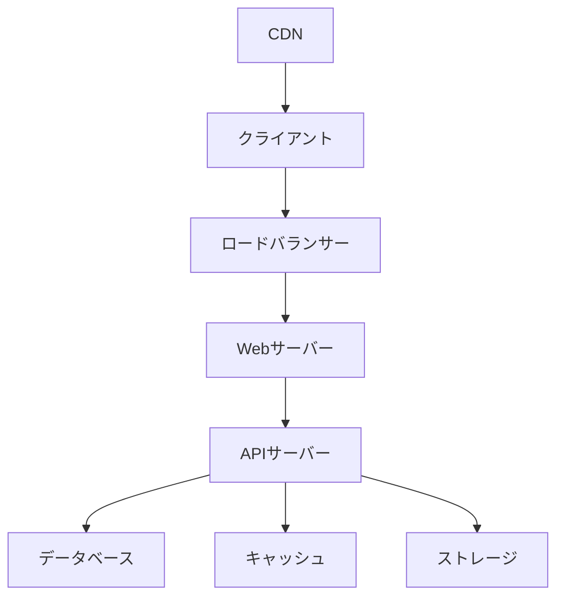
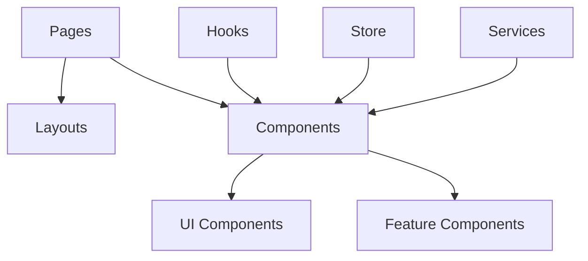
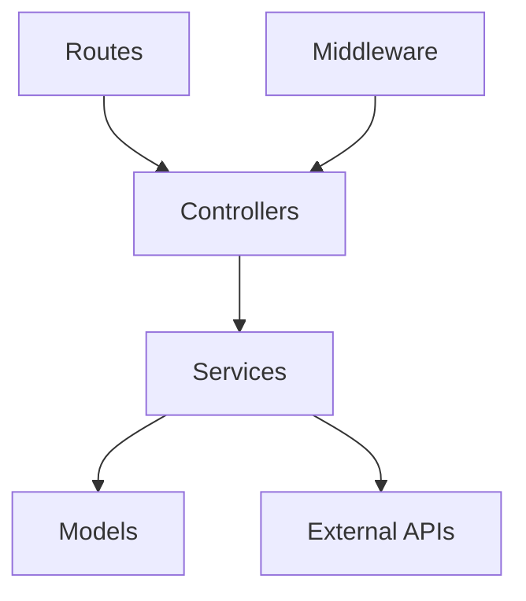
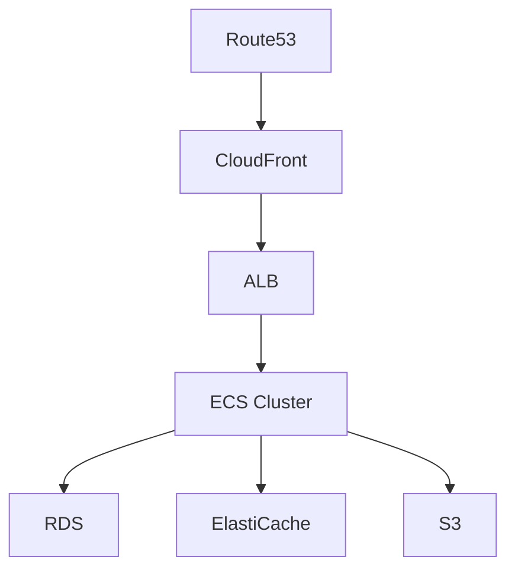

# システム設計書

## 1. システム概要

### 1.1 システム構成図

### 1.2 技術スタック
- フロントエンド
  - React 18.2+
  - TypeScript 5.0+
  - Next.js
  - TailwindCSS
- バックエンド
  - Node.js
  - Express
  - TypeScript
- データストア
  - PostgreSQL
  - Redis
- インフラ
  - AWS
  - Docker
  - Kubernetes

## 2. コンポーネント設計

### 2.1 フロントエンド構成

#### コンポーネント責務
- Pages: ルーティング、データフェッチ
- Layouts: 画面レイアウト
- Components: 再利用可能なUI要素
- Hooks: ビジネスロジック
- Store: 状態管理
- Services: API通信

### 2.2 バックエンド構成

#### レイヤー責務
- Routes: ルーティング定義
- Controllers: リクエスト/レスポンス制御
- Services: ビジネスロジック
- Models: データアクセス
- Middleware: 共通処理

## 3. データベース設計

### 3.1 データベース構成
- メインDB: PostgreSQL
  - ユーザーデータ
  - トランザクションデータ
  - マスターデータ
- キャッシュ: Redis
  - セッション情報
  - 一時データ
  - キャッシュデータ

### 3.2 バックアップ戦略
- フルバックアップ: 日次
- 差分バックアップ: 1時間ごと
- WALアーカイブ: リアルタイム
- リテンション期間: 30日

## 4. インフラストラクチャ設計

### 4.1 AWS構成

### 4.2 コンテナ化戦略
- マイクロサービスアーキテクチャ
- Docker Compose開発環境
- Kubernetes本番環境
- CI/CDパイプライン

## 5. セキュリティ設計

### 5.1 認証/認可
- JWT認証
- OAuth2.0連携
- RBAC権限管理
- 多要素認証

### 5.2 通信セキュリティ
- TLS 1.3
- 証明書自動更新
- WAF設定
- DDoS対策

### 5.3 データセキュリティ
- データ暗号化（保存時）
- データ暗号化（通信時）
- 個人情報マスキング
- アクセスログ管理

## 6. 監視設計

### 6.1 監視項目
- インフラメトリクス
  - CPU使用率
  - メモリ使用率
  - ディスク使用率
  - ネットワークトラフィック
- アプリケーションメトリクス
  - レスポンスタイム
  - エラーレート
  - アクティブユーザー数
  - スループット

### 6.2 アラート設定
- 重大度レベル
  - Critical: 即時対応
  - Warning: 24時間以内対応
  - Info: 定期確認
- 通知チャネル
  - Slack
  - メール
  - SMS

## 7. パフォーマンス設計

### 7.1 最適化戦略
- フロントエンド
  - コード分割
  - 画像最適化
  - キャッシュ戦略
  - バンドル最適化
- バックエンド
  - クエリ最適化
  - キャッシュ層
  - 非同期処理
  - コネクションプーリング

### 7.2 スケーリング戦略
- 水平スケーリング
  - オートスケーリング設定
  - ロードバランシング
- 垂直スケーリング
  - リソース監視
  - パフォーマンスチューニング

## 8. 障害対策設計

### 8.1 可用性設計
- マルチAZ構成
- フェイルオーバー機能
- バックアップリストア
- 災害復旧計画

### 8.2 復旧計画
- RTO（目標復旧時間）: 2時間
- RPO（目標復旧時点）: 5分
- 障害レベル別対応手順
- エスカレーションフロー

## 9. 運用設計

### 9.1 デプロイメント
- ブルー/グリーンデプロイ
- カナリアリリース
- ロールバック手順
- 自動化スクリプト

### 9.2 保守運用
- 定期メンテナンス計画
- パッチ管理
- ログローテーション
- キャパシティプランニング

## 10. テスト設計

### 10.1 テスト戦略
- 単体テスト
- 統合テスト
- E2Eテスト
- 負荷テスト
- セキュリティテスト

### 10.2 テスト環境
- 開発環境
- ステージング環境
- QA環境
- 本番環境 