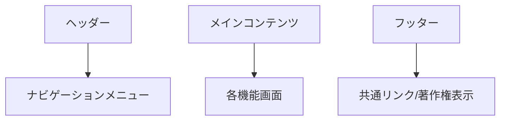
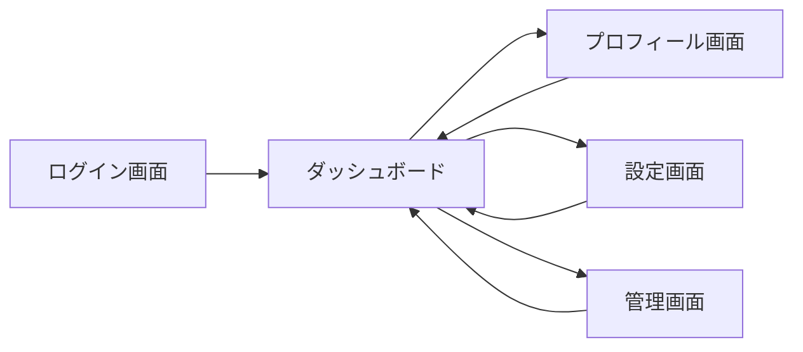

# 画面設計書

## 1. 画面構成概要

### グローバルレイアウト

### 画面一覧
1. ログイン画面
2. ダッシュボード
3. プロフィール画面
4. 設定画面
5. 管理画面

## 2. 画面遷移図

## 3. 各画面詳細

### 3.1 ログイン画面
#### レイアウト
- ロゴ
- メールアドレス入力フィールド
- パスワード入力フィールド
- ログインボタン
- パスワードリセットリンク

#### 機能要件
- バリデーション
  - メールアドレス形式チェック
  - パスワード最小文字数チェック
- エラーメッセージ表示
- ログイン状態の保持
- 多要素認証対応

### 3.2 ダッシュボード
#### レイアウト
- ヘッダー
  - ユーザー情報
  - 通知アイコン
  - ログアウトボタン
- サイドバー
  - メニュー項目
  - ステータス表示
- メインコンテンツ
  - データ可視化セクション
  - アクティビティログ
  - クイックアクション

#### 機能要件
- リアルタイムデータ更新
- レスポンシブ対応
- ダークモード対応
- カスタマイズ可能なウィジェット

### 3.3 プロフィール画面
#### レイアウト
- プロフィール画像
- 基本情報編集フォーム
- アカウント設定
- 活動履歴

#### 機能要件
- 画像アップロード
- 情報更新のバリデーション
- パスワード変更機能
- アクティビティログ表示

### 3.4 設定画面
#### レイアウト
- カテゴリータブ
  - 一般設定
  - 通知設定
  - セキュリティ設定
  - 表示設定
- 設定項目フォーム

#### 機能要件
- 設定の即時反映
- 設定のエクスポート/インポート
- デフォルト値へのリセット
- 変更履歴の管理

### 3.5 管理画面
#### レイアウト
- ユーザー管理セクション
- システム設定セクション
- ログ管理セクション
- バックアップ/リストアセクション

#### 機能要件
- ユーザーの追加/編集/削除
- 権限管理
- システム状態モニタリング
- バックアップスケジュール設定

## 4. コンポーネント設計

### 4.1 共通コンポーネント
#### ボタン
- プライマリーボタン
- セカンダリーボタン
- テキストボタン
- アイコンボタン

#### フォーム要素
- テキスト入力
- セレクトボックス
- チェックボックス
- ラジオボタン
- データピッカー

#### カード
- 情報カード
- アクションカード
- 統計カード

#### モーダル
- 確認モーダル
- フォームモーダル
- 画像プレビューモーダル

### 4.2 専用コンポーネント
#### ダッシュボード
- データチャート
- ステータスインジケーター
- アクティビティフィード

#### プロフィール
- プロフィール画像アップローダー
- 情報編集フォーム
- アクティビティタイムライン

#### 管理画面
- ユーザーテーブル
- 権限マトリックス
- システムステータスモニター

## 5. レスポンシブデザイン

### ブレークポイント
- モバイル: ~767px
- タブレット: 768px~1023px
- デスクトップ: 1024px~

### レイアウト変更点
#### モバイル
- サイドバーをハンバーガーメニューに変更
- グリッドレイアウトを1カラムに変更
- フォントサイズの最適化
- タッチ操作の最適化

#### タブレット
- 2カラムレイアウトの採用
- サイドバーの選択的表示
- 要素サイズの最適化

#### デスクトップ
- フルレイアウトの表示
- ホバーエフェクトの追加
- ショートカットキーの有効化

## 6. アクセシビリティ対応

### WAI-ARIA
- ランドマークロール
- アリアラベル
- フォーカス管理
- キーボード操作

### カラーコントラスト
- WCAG 2.1 AAレベル準拠
- ダークモード対応
- ハイコントラストモード対応

### その他
- スクリーンリーダー対応
- 代替テキスト
- フォーカス可視化
- 文字サイズ変更対応

## 7. アニメーション/トランジション

### 種類
- ページ遷移
- モーダル表示/非表示
- 要素のフェードイン/アウト
- ローディングアニメーション

### 実装方針
- CSS Transitions優先
- 必要最小限のアニメーション
- パフォーマンスへの配慮
- アニメーション無効化オプション

## 8. エラーハンドリング

### エラー表示
- インラインエラー
- エラーメッセージ
- トースト通知
- エラーページ

### 実装方針
- わかりやすいエラーメッセージ
- リカバリーアクションの提示
- エラーログの記録
- グレースフルデグラデーション

## 9. パフォーマンス最適化

### 実装方針
- コンポーネントの遅延ローディング
- 画像の最適化
- キャッシュ戦略
- バンドルサイズの最適化

### モニタリング
- Core Web Vitals
- ページロード時間
- インタラクション応答時間
- メモリ使用量 